# DuckDB Analysis Environment for Book Metadata

> **Note:** The default configuration is optimized for systems with 30GB RAM. If you have more resources available, you can adjust the parameters accordingly, especially the chunk size (currently set to 10MB) for file processing.

## 🌟 Features

- **Data Processing Pipeline**
  - GZ file decompression
  - JSON to Parquet conversion
  - Chunked processing for large datasets (10MB chunks by default)
  - Memory-efficient operations

- **Analysis Capabilities**
  - Advanced SQL queries with DuckDB
  - Interactive data exploration
  - Rich visualizations with Matplotlib and Seaborn
  - Statistical analysis tools

- **Technical Stack**
  - DuckDB for high-performance SQL queries
  - Jupyter for interactive analysis
  - Pandas for data manipulation
  - Matplotlib & Seaborn for visualization
  - Docker for environment consistency
  
- **Smart Schema Analysis**
   - Automated JSON structure analysis:
   - Samples 10% of dataset for efficient schema detection (configurable)
   - Intelligent column creation based on key frequency (>50% threshold, adjustable)
   - Optimized memory usage through chunked processing
   - Dynamic schema evolution handling

## 📥 Data Setup

### System Requirements
- Minimum: 30GB RAM (default configuration)
- Storage: Depends on dataset size
- Adjustable parameters:
  - Chunk size: Default 10MB (can be increased with more RAM)
  - DuckDB memory limit: Default 28GB (can be adjusted in configuration)

### File Structure
```
project/
├── data/
│   ├── elasticsearch/    # Original .gz files from Elasticsearch
│   ├── elasticsearchF/   # Final .parquet files from Elasticsearch
│   ├── elasticsearchAux/ # Additional Elasticsearch data
│   ├── elasticsearchAuxF/# Final .parquet files from Elasticsearchaux
│   ├── aac/             # AAC Data .zst files
│   ├── aacF/            # Final .parquet files from aac data
│   ├── mariadb/         # Original MariaDB data files
│   ├── mariadbF/        # Final .parquet files from MariaDB data
├── notebooks/
│   ├── Elasticsearch_Queries.ipynb    # Elasticsearch analysis notebook
│   ├── ElasticsearchAux_Queries.ipynb # ElasticsearchAux analysis notebook
│   ├── AAC_Queries.ipynb             # AAC analysis notebooks
│   └── Mariadb_Queries.ipynb         # MariaDB analysis notebook
```

### Data Processing Steps

1. **Elasticsearch Data**
   - Place all `.gz` files in the `data/elasticsearch/` folder and all `.gz` files in the `data/elasticsearchAux/` folder.
2. **AAC Data**
   - Place all `.zst` files in the `data/aac/` folder.
   - Then, run the processing script to convert the files to Parquet format.
3. **MariaDB Data**
   - Place all `.gz` files in the `data/mariadb/` folder.
   - Then, run the processing script to convert the files to Parquet format.


### Processing the data 

#### Using initialScript.py
```bash
python SetupInitial.py
```

This script will:
1. Create all necessary directories
2. Process Elasticsearch, ElasticsearchAux and AAC data
3. Convert to Parquet format


## 📊 Elasticsearch Analysis Examples

### Publication Year Distribution


Analysis of publication years across the Elasticsearch dataset.

### Language Analysis


Distribution of languages in the Elasticsearch collection.

### Rare vs. Non-Rare Books Analysis


Distribution between rare and non-rare books in the Elasticsearch dataset.

### AACID Analysis


AACID patterns and distribution analysis.

### Download Availability Analysis


Analysis of download options in the Elasticsearch dataset.

### Cover URL Analysis


Distribution of cover image availability.

### File Size Distribution by Content Type


File size analysis across different content types.

### Classification Analysis


Book classification distribution analysis.

### Score Analysis


Analysis of base rank scores in the dataset.

## 📊 ElasticsearchAux Analysis Examples (These data are not complete, they are the result of the query in 1/12 of the dataset.)

### Content Types Analysis

Distribution of different content types across the dataset.

### Publication Year Analysis

Histogram showing publication trends over different years.

### Language Distribution Analysis

Breakdown of languages represented in the dataset.

### File Size Analysis

Distribution of file sizes throughout the collection.

### Publisher Analysis

Top publishers represented in the dataset by volume.

### File Extensions Analysis

Frequency of different file formats in the collection.

### Access Type Analysis

Analysis of different access methods for the content.

### Publications Over Time by Content Type

Trend analysis of how content types evolved over publication years.

### Author Analysis

Most represented authors in the dataset.

### Language and Publication Year Correlation

How language distribution changes across publication years.

### Torrent Availability Analysis

Analysis of torrent availability for the content.

### Title Word Cloud Analysis

Visual representation of most common words in titles.

### Publication Year and File Size Correlation

Examining how file sizes relate to publication years.

### File Extension and Content Type Analysis

Relationship between file formats and content categories.

### Combined Dataset Comparison Overview

Comparative analysis of multiple datasets in the collection.

## 📊 AAC Analysis Examples

### Airiti Books Analysis


### Bloomsbury Analysis
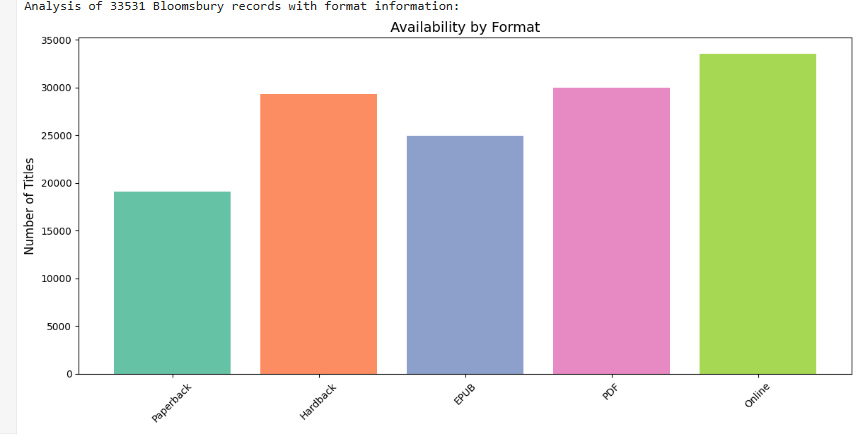
ISBN Analysis and Collection Types

### CERLALC Records Analysis
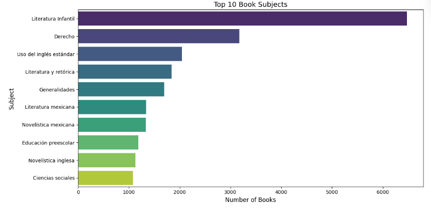
Top subjects and publishers

### Chinese Architecture Analysis
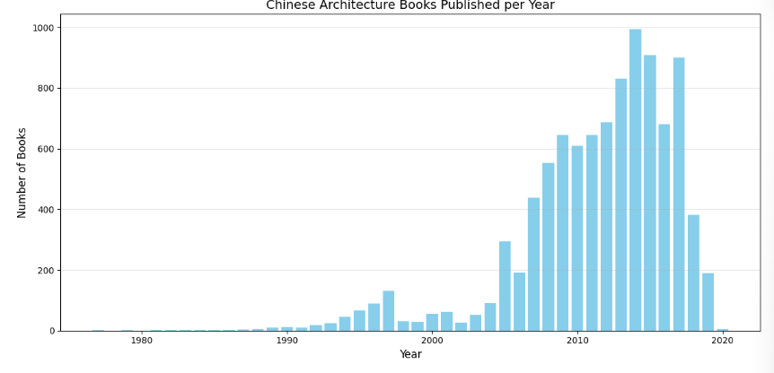
Publication Analysis by Year and Publisher

### Czech Records Analysis
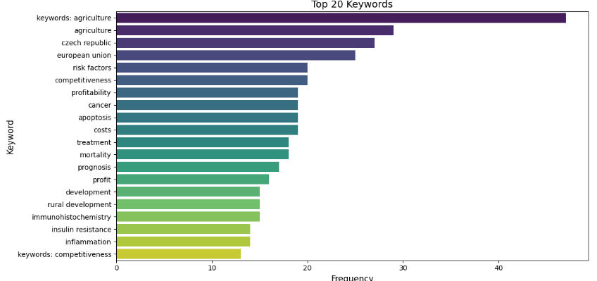
Keyword Analysis

### DuXiu Records Analysis
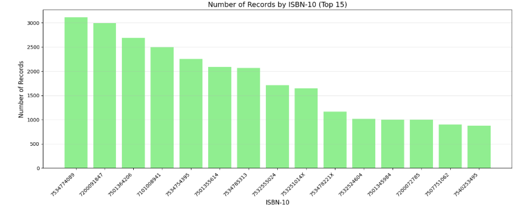
SQL query to get the number of records by ISBN-10

### EBSCO Records Analysis
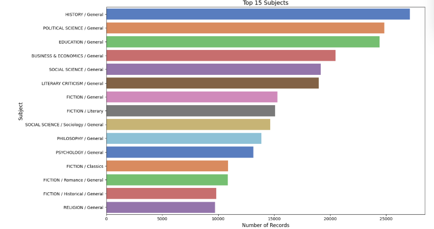
SQL query to analyze the subjects and subject types

### Google Books Analysis
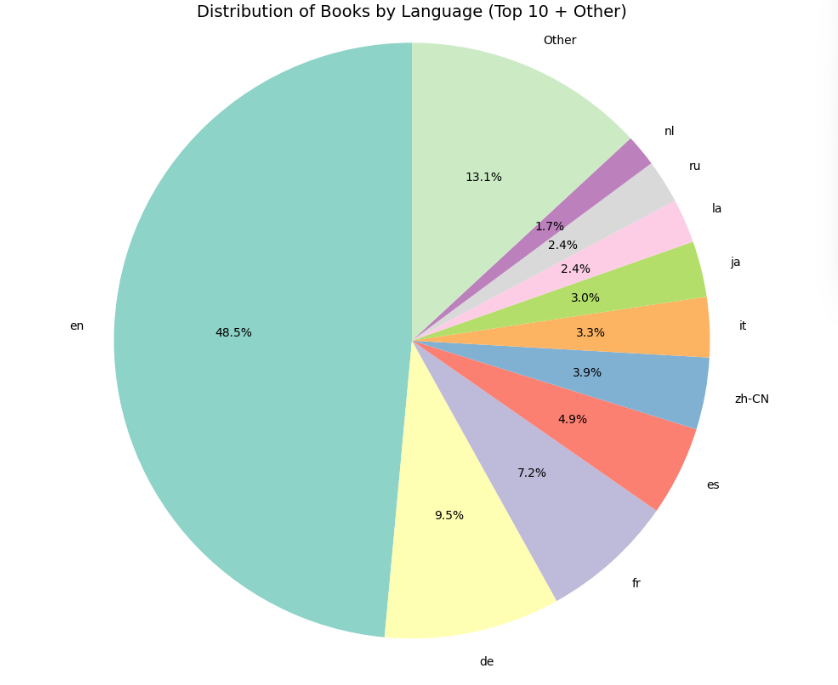
SQL query to analyze books by language, keeping top 10 languages and grouping others as "Other"

### Goodreads Analysis
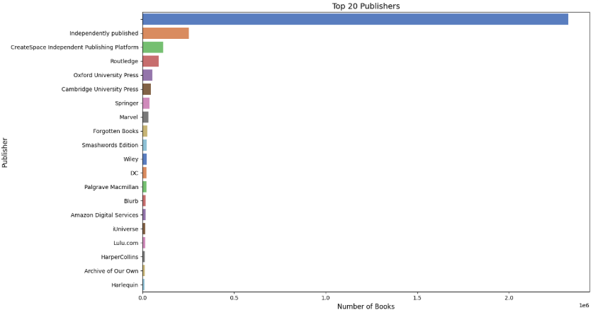
SQL query to analyze book statistics

### ISBN Group Analysis
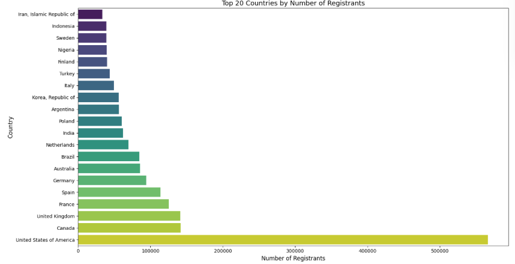
SQL query to analyze geographic and agency data

### Kulturpass Analysis
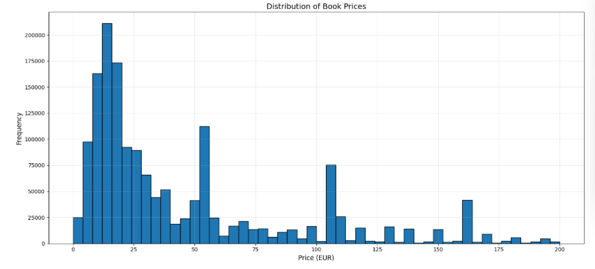
Book and Price Analysis

### Libby Records Analysis
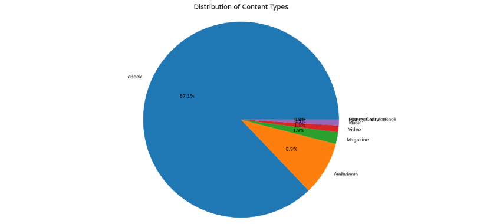
Content and Publisher Analysis

### Magazine Database Analysis
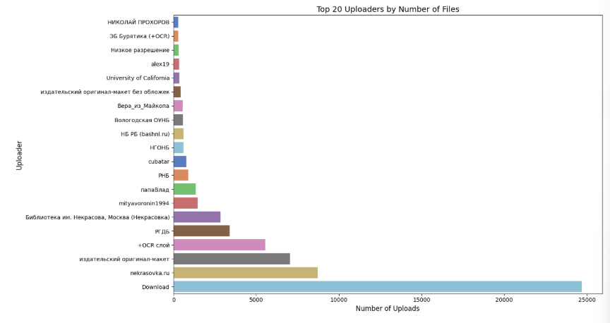
Upload and File Analysis


## 📊 MariaDB Analysis Examples

### Analysis of record distribution across different sources

Combines data from multiple archive sources to compare coverage

### Analysis of record ID prefixes distribution

Examines the distribution of different types of identifiers

### Series analysis from LibGen

Analyzes the distribution and characteristics of book series

### Code prefix analysis

Examines the distribution of code prefixes across different lookup tables

### ZLib book analysis

Analyzes the distribution of books in ZLib by language and file type

### LibGen editions analysis

Examines the temporal distribution of publications

### Archive metadata analysis

Analyzes the distribution of records across different archive sources

### Series temporal analysis

Analyzes the temporal distribution of series publications

### File characteristics analysis

Examines the distribution of file properties across different sources

### ISBN analysis

Analyzes the distribution and characteristics of ISBN records

## 🚀 Quick Start

1. **Clone the Repository**
   ```bash
   git clone <repository-url>
   cd <project-directory>
   ```

2. **Build the Docker Image**
   ```bash
   docker-compose build
   ```

3. **Start the Environment**
   ```bash
   docker-compose up
   ```

4. **Access Jupyter**
   - Open the URL shown in the console
   - Default: http://localhost:8888

## 📊 Available Notebooks

### DATA Analysis
- `Elasticsearch_Queries.ipynb`: Elasticsearch Queries
- `ElasticsearchAUX_Queries.ipynb`: ElasticsearchAUX Queries
- `AAC_Queries.ipynb`: AAC Queries
- `Mariadb_Queries.ipynb`: MariaDB Queries

## 🔧 Configuration

### Memory Settings
- Default RAM requirement: 30GB
- DuckDB memory limit: 28GB (adjustable)
- Chunk size: 10MB (adjustable)
- Python environment: 3.12

### Performance Tuning
For systems with more resources:
- Increase chunk size for faster processing
- Adjust DuckDB memory limit
- Modify parallel processing parameters

### Docker Settings
- Port mapping: 8888:8888
- Volume mounts for data persistence
- Jupyter notebook directory mapping
